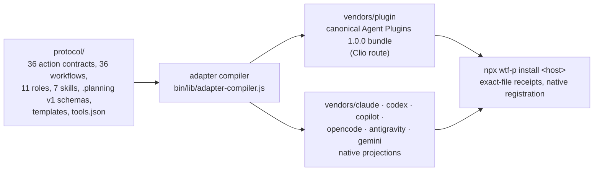

<div align="center">


# WTF-P

**Write The F\*\*\*ing Paper.**

Also: Proposal. Presentation. Poster.

Human-guided research and writing workflows for AI coding agents.

</div>

WTF-P gives your coding agent one portable academic method: interview the
author, map the evidence, record decisions, build an outline, plan and draft
one section at a time, review it, and resume later from durable state. You keep
the scientific judgment. The agent keeps the bookkeeping and does bounded jobs.

It ships as one canonical [Agent Plugins 1.0.0](https://agent-plugins.org)
bundle that a deterministic compiler projects into a native package for seven
coding-agent hosts. Version `0.7.0` is the current stable release and is
what npm `latest` resolves to; v0.5 remains installable by explicit version.

**Optional CiteNexus research backend (0.7.0):** `citation-search --backend=cite-nexus`
queries Crossref, DataCite and Europe PMC by default, plus explicitly selected academic
APIs, through the [CiteNexus](docs/CITE_NEXUS.md) MCP server. Results keep their source
evidence and stay candidates. CiteNexus is a separate Python package
(`pip install cite-nexus-mcp==0.2.0`) that WTF-P never installs for you. Research
actions reach it on Clio Coder and Claude Code; the other hosts keep their existing
capability blockers.

## Install on your agent

Two routes. Pick one per host; both register the same plugin, so do not use
both on the same profile.

**From this repository, with the host's own plugin manager.** Claude Code,
Codex, and Copilot CLI read a marketplace straight from the Git repository and
load the committed envelope, so no installer runs:

```bash
claude plugin marketplace add akougkas/wtf-p && claude plugin install wtfp@wtf-p
codex plugin marketplace add akougkas/wtf-p && codex plugin add wtfp@wtf-p
copilot plugin marketplace add akougkas/wtf-p && copilot plugin install wtfp@wtf-p
```

Codex still needs the eleven role agents copied to `$CODEX_HOME/agents/`,
because Codex plugins do not carry agents; the npm installer does that for
you, the Git route does not.

**From npm, with the WTF-P installer.** You need Node.js 20 or newer and one
supported host. Run one line. The installer publishes the generated package
into that host's own configuration root, records an exact-file receipt, and
registers it with the host's native plugin lifecycle where one exists.

| Host | Install | Native registration the installer performs | Verified with |
| --- | --- | --- | --- |
| Clio Coder (0.4.7 or newer) | `npx --yes --package=wtf-p@0.7.0 -- wtf-p install clio` | `clio-coder library install <staged-bundle> --user`, then `clio-coder library inspect wtfp --user --json` | 0.4.8 |
| Claude Code | `npx --yes --package=wtf-p@0.7.0 -- wtf-p install claude` | `claude plugin marketplace add <root>/marketplaces/wtfp --scope user`, then `claude plugin install wtfp@wtfp --scope user -y` | 2.1.271 |
| Codex | `npx --yes --package=wtf-p@0.7.0 -- wtf-p install codex` | `codex plugin marketplace add <root>/marketplaces/wtfp`, then `codex plugin add wtfp@wtfp --json`; agents copied to `$CODEX_HOME/agents/` | 0.153.3 |
| GitHub Copilot CLI | `npx --yes --package=wtf-p@0.7.0 -- wtf-p install copilot` | `copilot plugin marketplace add <root>/marketplaces/wtfp`, then `copilot plugin install wtfp@wtfp` | 1.0.83 |
| OpenCode | `npx --yes --package=wtf-p@0.7.0 -- wtf-p install opencode` | Files under the OpenCode config root; OpenCode discovers them by directory | 1.18.31 |
| Antigravity CLI | `npx --yes --package=wtf-p@0.7.0 -- wtf-p install antigravity` | `agy plugin install <root>/sources/wtfp` | 1.2.2 |
| Gemini CLI | `npx --yes --package=wtf-p@0.7.0 -- wtf-p install gemini` | Files under `<root>/extensions/wtfp`; Gemini discovers the extension by directory | 0.59.0 |

"Verified" means native discovery in a disposable profile on this exact
envelope, with the commands recorded in
[Host capabilities](docs/HOST_CAPABILITIES.md). Clio Coder is published as
`@iowarp/clio-coder`; 0.4.7 and newer carry the plugin engine WTF-P uses.

Keep the explicit `--package=wtf-p@<version> -- wtf-p` form. On a workstation
with WTF-P 0.5 installed globally, the shorter `npx wtf-p@<version>` can run
the old executable instead.

## Sixty-second start

```bash
npx --yes --package=wtf-p@0.7.0 -- wtf-p install clio
cd /path/to/your-paper-or-proposal
clio-coder --autonomy suggest
```

```text
/wtfp:help
/wtfp:new-paper I am preparing a research proposal on reproducible scientific workflows. Interview me before deciding the scope, claims, evaluation, team, budget, or timeline. Use only the evidence I provide and mark unknowns instead of inventing citations.
```

The agent interviews you, previews the five initial project records, and waits
for your approval before writing anything. Every host uses the same
`/wtfp:<action>` names except Codex, which exposes the same actions through
seven native skills: mention `$wtfp-start-project` and ask for the
`new-paper` action with the same brief.

A normal project then moves one action at a time:

```text
/wtfp:map-project        inventory the materials you supplied
/wtfp:create-outline     argument, dependencies, exact word budget, for approval
/wtfp:discuss-section    capture your intent for one section
/wtfp:plan-section       one checked, executable plan
/wtfp:write-section      draft only from the approved plan and evidence
/wtfp:review-section     independent review, findings recorded, nothing rewritten
/wtfp:pause-writing      durable handoff; quit the client
/wtfp:resume-writing     a fresh process picks up from disk
```

See [Getting started](docs/GETTING_STARTED.md) for each host's launch command,
Codex skill selectors, isolated evaluation profiles, and troubleshooting.

## What it writes

Four document types share the same action set and differ in their scaffold:

| Workflow | Scaffold | Entry actions |
| --- | --- | --- |
| Paper (article, conference, review, thesis chapter) | `protocol/templates/paper-outline.md` | `new-paper`, `create-outline` |
| Grant proposal (solicitation-driven) | `protocol/templates/grant-proposal-outline.md` | `new-paper`, `create-outline`; see the [proposal workflow](docs/PROPOSAL_WORKFLOW.md) |
| Poster | `protocol/templates/poster.md` | `create-poster` |
| Presentation | `protocol/templates/slides.md` | `create-slides` |

The catalog has 36 stable actions across seven skills: start a project,
research the literature, plan a section, write a section, review the
manuscript, manage the project, and deliver. Availability is decided per host
by the generated `compatibility/action-availability.json`, and an unavailable
action returns `WTFP_ACTION_UNAVAILABLE` instead of improvising:

| Host | Available | Fails closed |
| --- | ---: | --- |
| Clio Coder, Claude Code | 31 / 36 | `contribute`, `report-bug`, `request-feature` (no `external.issue` binding); `remove-section` (no `filesystem.delete`); `update` (no `package.update`) |
| Codex, Copilot CLI, OpenCode, Antigravity, Gemini | 26 / 36 | the five above plus `research-gap`, `analyze-bib`, `check-refs`, `audit-milestone`, `export-latex`, whose `tool.execute` effect is bound only to Clio `bash` and Claude `Bash` |
| Copilot cloud projection (`.github`) | 5 / 36 | everything that needs an explicit approval gate |

Where the research routes are available, `tool.execute` authorizes exactly one
command, the bundled `tools/wtfp-tool.js` dispatcher over seven bibliography
and citation tools. Run it with `--offline` until you approve network use.

## What it will not do

- It does not write without you. Outline, plan, write, review, and delivery
  gates are on by default, and a gate is crossed only through the host's real
  interaction tool, never by silence or a model's own recommendation.
- It does not invent evidence. Sources and evidence are separate records with
  provenance; a missing citation stays missing.
- It does not render or compile. `create-poster`, `create-slides`, and
  `export-latex` emit source and hand you the render or compile command.
- It does not submit. `submit-milestone` writes a local archive, not a
  submission to a funder, journal, or service.
- It does not touch Git or publish. No WTF-P action initializes, commits,
  branches, pushes, tags, or publishes as a side effect.
- It does not claim more than it has observed. Native discovery is verified
  per host; model-backed lifecycle evidence is partial and listed in
  [Compatibility](docs/COMPATIBILITY.md).

## How it is built

One protocol, one compiler, seven projections. Humans edit `protocol/`; the
compiler owns every file under `vendors/`, authenticates each envelope with a
SHA-256 inventory, and fails closed when a host cannot bind a capability an
action requires.



Project memory lives in the paper directory: control records under
`.planning/` (project, config, state, decisions, outline, sources, evidence,
sections, checkpoints, validations) and manuscript artifacts under `paper/`.
Another process, or another supported host, resumes from those files rather
than from chat history.

## Learn more

- [Documentation index](docs/README.md)
- [Getting started](docs/GETTING_STARTED.md)
- [Host capabilities and verification commands](docs/HOST_CAPABILITIES.md)
- [Proposal workflow](docs/PROPOSAL_WORKFLOW.md)
- [Migrating from v0.5](docs/MIGRATION_V05_TO_V06.md)
- [Compatibility and evidence](docs/COMPATIBILITY.md)
- [Packaging and the Clio plugin lifecycle](docs/AGENT_PLUGIN.md)
- [Building and releasing](docs/BUILD_AND_RELEASE.md)
- [Changelog](CHANGELOG.md) and [Contributing](CONTRIBUTING.md)

WTF-P was built at the [Gnosis Research Center](https://grc.iit.edu/) at
Illinois Tech for research teams with papers to publish, grants to win, and no
time for writer's block.

<div align="center">

**No more excuses. Ship the paper.**

</div>
